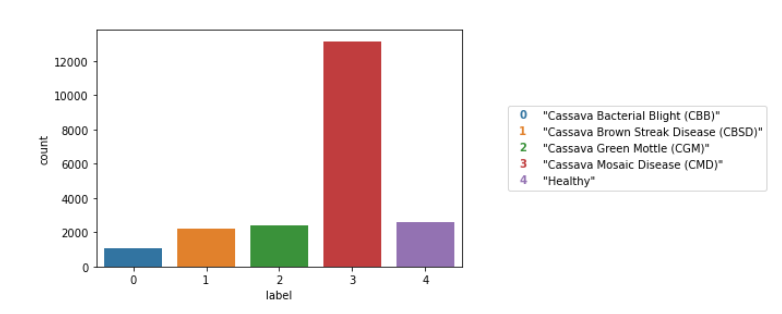

# Cassava-Leaf-Disease-Classification-on-Kaggle

This repository contains a Convolutional Neural Network (CNN) model developed for a Kaggle competition. The model achieved the following scores:

- **Public Score**: 0.8333
- **Private Score**: 0.8284

These scores reflect the model's performance on the respective datasets and demonstrate its effectiveness in the competition.

Kaggle offers several data sets of cassava leaves.

This competition was about distinguishing between different diseases that harm the food supply of many African countries. In some cases, the main remedy is to burn the infected plants to prevent further spread, which can make a quick, automated remedy quite useful for farmers.

The task was to identify the type of disease from an image of a cassava leaf.
 
You can find the data sets on the following link: https://www.kaggle.com/competitions/cassava-leaf-disease-classification/data

<!---->

<!---->

    

 

As you can see below, the class distribution is very unbalanced.

    

